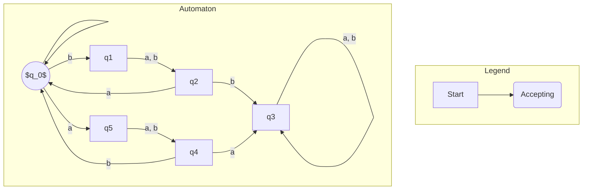

## [[מדעי המחשב]]
## [[מדעי הקוגניציה]]
## [[שטויות]]
## [[העשרה]]
---
# סמסטר 2026א
## [[מערכות הפעלה]]
## [[ארגון המחשב]]
## [[אינפי 2]]

# מועדי ב׳ ופרוייקטים 2025א
## [[אלגברה לינארית 1]]
## [[מעבדה בתכנות מערכות]]
## [[אינפי 1]]
## [[אלגוריתמים]]

# לעשות
- [ ] הקמת סביבה של xv6 עבור [[מערכות הפעלה]]
- [ ] לקרוא את פרק אחד במדריך למידה של [[מערכות הפעלה]]
- [ ] לקרוא פרק א ב[[ארגון המחשב]]
- [ ] לקרוא יחידה 1 ב[[אינפי 2]]
- [ ] לסכם פרק אחד במדריך למידה של [[ארגון המחשב]]
- [ ] לסכם פרק א ב[[מערכות הפעלה]]
- [ ] לכתוב רשימת פערים ביחידה 1 של [[אינפי 2]]

