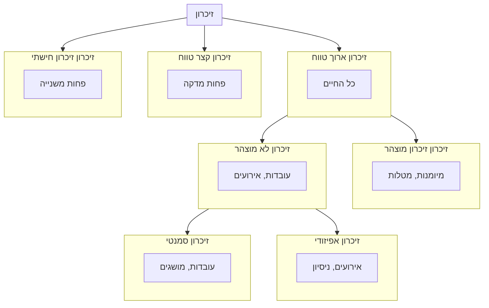

![[Pasted image 20240728214949.png|Mother and Child, Ferdinand Hodler]]

- שינויים עצביים ארוכי טווח

# 1	[[זיכרון חישתי]]
# 2	[[זיכרון קצר טווח]]
# 3	[[זיכרון ארוך טווח]]
# 4	[[הגברה ארוכת טווח]]
# 5	[[שינויים סינפטיים]]
