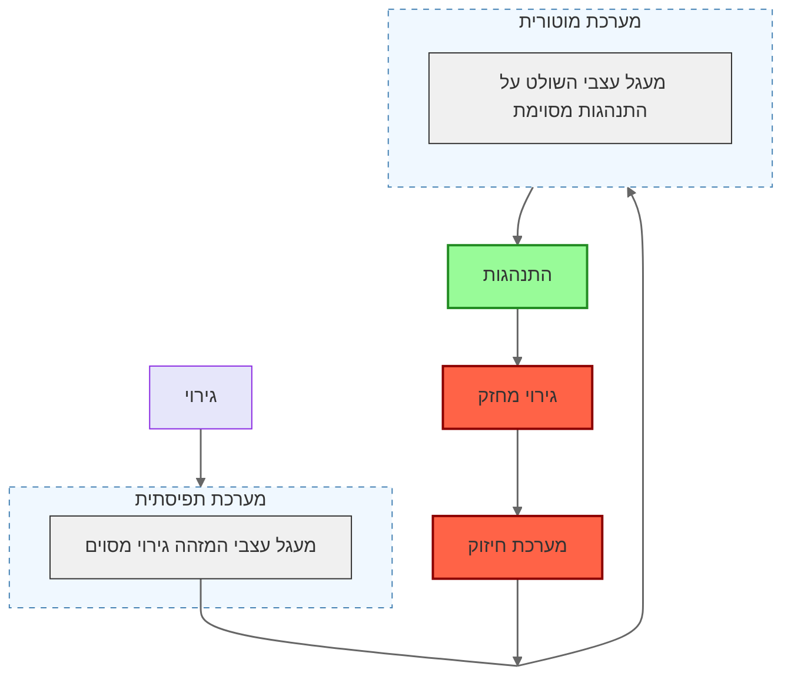

- שינויים ב[[מערכת העצבים]] באופן הnגביר התסברות ש[[גירוי]] מסויים יעורר [[תגובה]] מסויימת
- חיזוק קשרים בין תפיסה של [[נוירון סנסורי|נוירון חישתי]] של [[גירוי מבחין]] ו[[נוירון מוטורי]] של [[תגובה]]

