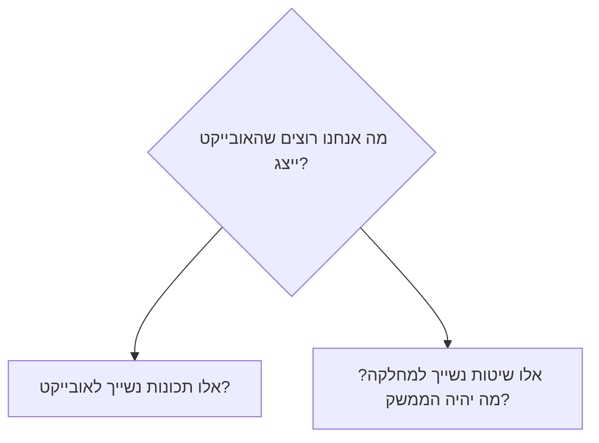

- מאפייני מחלקה
- מבנה כליי של מחלקה
- מימוש של מחלקה

מאפייני מחלקה
- תבנית שממנו מייצרים אובייקטים מטיפוס המחלקה
- תכונות attributes מצבו הפנימי
- שיטות methods פעולות של או על האובייקט
- אובייקטים משתנים במצבם (ערך התכונות) אך חולקים שיטות.

- מחלקה: כדורגלן
	- תכונות
		- ש פרטי
		- ש משפחה
		- קבוצה
		- תפקיד
		- שערים
	- שיטות
		- בעט לשער()
		- רד לספסל()
אובייקט: כדורגלן
	- תכונות
		- ש פרטי: ליונל
		- ש משפחה: מסי
		- קבוצה: ברצלונה
		- תפקיד: חלוץ
		- שערים: 38
	- שיטות
		- בעט לשער()
		- רד לספסל()

```java
public class NameOfClass
{
	declarations
	constructor definitions
	method definitions
} // end of class
```

מחלקה Point
```java
public class Point
{
	private int _x;
	private int _y;

	public Point(int x, int y);
	public void move (int deltaX, int deltaY);
	public void printStatus();

	public void printStatus()
	{
		System.out.println("("+ x +","+ y +")")
	}

	public int powerNum (int num)
	{
		if(num==5)
			return(num*num);
		return int x = 3+4;
	}
}
```
בנאי constructor
- תמיד כשם המחלקה
- שיטה מיוחדת תפקידה לייצר אובייקט ולאתחל את שדותיו
- מיד אחרי המשתנים והקבועים
```java
public Point (int x, int y)
{
_x = x;
_y = y;
}
```
השמה: ```Point p1 = new Point(2,1)```
