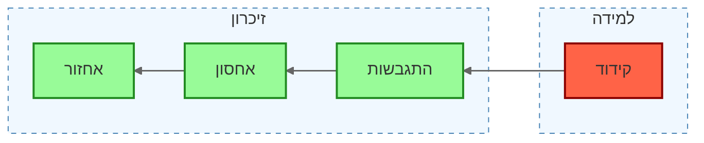

![[Pasted image 20240603171421.png|The School of Athens, Raphael]]

![[Pasted image 20240603171557.png|Study of a woman's hands, Leonardo Da Vinci]]![[Pasted image 20240603171747.png|Self Portait - Head I, William Utermohlen]]

# 2	[[למידה]] 
# 3	[[זיכרון]] 
