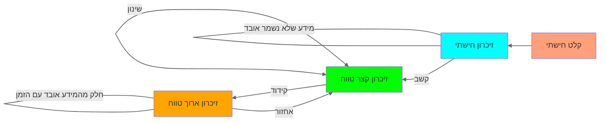

![[Pasted image 20240728215833.png|Samuel learning from Eli, John Singleton Copley]]
- רכישת מידע על ידי שינוי עצבי המובילה לשינויים התנהגותיים

# 1	[[למידת גירוי תגובה]]
# 2	[[חיזוק]]
# 3	[[למידה תפיסתית]]
# 4	[[למידה מוטורית]]
# 5	[[למידת יחסים]]