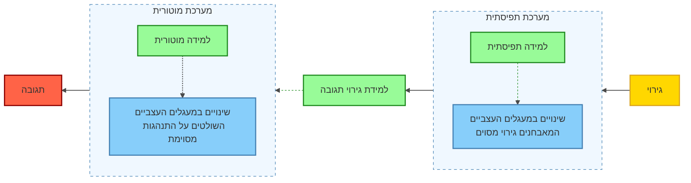

---
aliases:
- stimulus response learning
---
- [[למידה]] לבצע התנהגות בהתאם לגירוי
- [[נוירון סנסורי|נוירון חישתי]] $\iff$ [[נוירון מוטורי]]
- [[רפלקסים]], נגינה, כתיבה וכדומה

# 1	[[התנייה קלאסית]]
# 2	[[התנייה אופרנטית]]

| ״        | רפלקסים | קישור                      |
| -------- | ------- | -------------------------- |
| קלאסית   | X       | גירוי ← תגובה              |
| אופרנטית | V       | שינוי התנהגות על סמך תוצאה |
