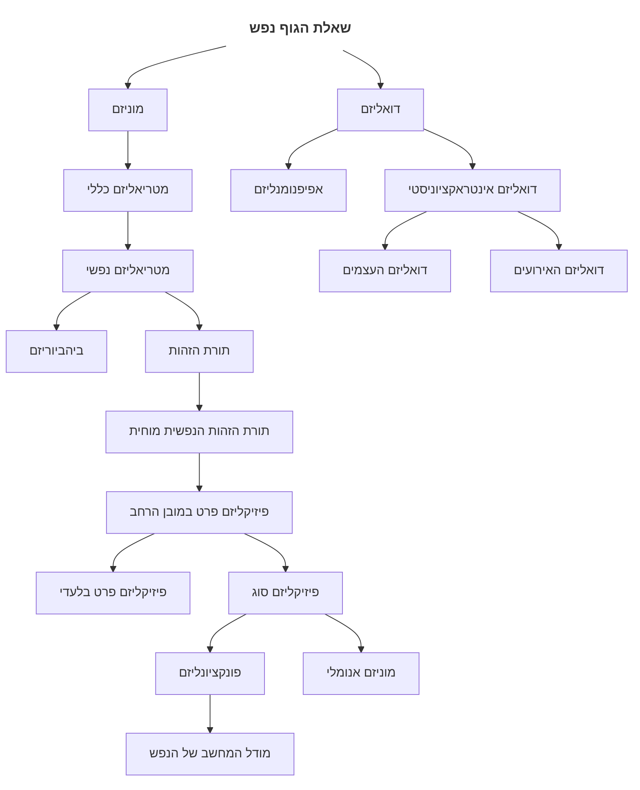

# 1	חומרי הקורס
## 1.1	אופ
- [[Philosophy of the Soul Coursebook 2024.pdf|ממנים]]
- [[Philosophy of the Soul Semester Topics.pdf|מיקוד]]
- [[10679-2024b Reading and Learning 1.pdf|תיקונים לספר]]
## 1.2	יחידות לימוד
- [[יחידות 1-3.pdf]]
- [[יחידות 4-5.pdf]]
- [[יחידות 7-8.pdf]]
- [[יחידות 8-9.pdf]]
## 1.3	קישורים שימושיים
- [SED](https://plato.stanford.edu/entries/consciousness/)
- [Jeffrey Kaplan](https://www.youtube.com/playlist?list=PL7YPshZMeLIa4ETIJvKtt8IxXmHSjof9Y)
- [Ryan Rhodes](https://www.youtube.com/playlist?list=PLLOLWhN1qSnwcD8HX4r9EBvFWiAfijHxp)
# 2	מפגשים
- [[הנפש והמוח - תורת הזהות המטריאליסטית]]
- [[מפגש מספר 1]]
- [[מפגש מספר 2]]
- [[מפגש מספר 3]]
- [[מפגש מספר 4]]
- [[מפגש מספר 6]]
- [[מפגש מספר 7]]
- [[מפגש מספר 8]]
- [[מפגש מספר 9]]
- [[מפגש מספר 10]]
- [[פונקציונליזם ומודל המחשב של הנפש]]

# 3	סיכום
![[Pasted image 20240528205530.png|The Human Condition, Rene Magritte]]![[Pasted image 20240528205559.png|Metamorphosis of Narcisuus, Salvador Dali]]![[Pasted image 20240528205652.png|The Thinker, Auhuste Rodin]]

## 3.1	בסיס

### 3.1.1	[[חיים וחיים נפשיים]]
### 3.1.2	[[ייצורים נפשיים]]
### 3.1.3	[[בעיית הנפשות האחרות]]
### 3.1.4	[[סיבתיות נפשית]]
### 3.1.5	[[שאלת הגוף והנפש]]
### 3.1.6	[[מושגים קוגניטיביים של מודעות]]
### 3.1.7	[[מכוונות]]

## 3.2	עמדות

![[Philosophy of Mind Map.canvas|Philosophy of Mind Map]]

# 4	ממנים

## 4.1	ממן 11

![[Philosophy of the Soul Coursebook 2024.pdf#page=9]]

- [[ממ״ן 11.docx|תום ארי]]

## 4.2	ממן 12

![[Philosophy of the Soul Coursebook 2024.pdf#page=10]]

- [[ממ״ן 12.docx|תום ארי, 82]]

## 4.3	ממן 13

![[Philosophy of the Soul Coursebook 2024.pdf#page=11]]

## 4.4	ממן 14

![[Philosophy of the Soul Coursebook 2024.pdf#page=12]]

# 5	שאלות חזרה

## 5.1	יחידה 1

1.
	1. הסבירו מהי מכוונות של מצבים נפשיים
	2. מהם הקשיים העומדים בפני הטוענים שמכוונות מהווה מאפיין מבחין של התחום הנפשי?
1.
	1. הסבירו מהי מודעות רפלקטיבית (מודעות מסדר שני)
	2. האם ומדוע מודעות רפלקטיבית אינה יכולה באופן עקרוני להיות מאפיין של כל המצבים הנפשיים
1.
	1. הציגו את האפיינים האפיסטמיים השונים המיוחסים למצבים נפשיים
	2. יש הטוענים שידע והאמנות של אדם בדבר מצביו הנפשיים הם פרטיים וישירים. הסבירו. 
1.
	1. הסבירו מהי שקיפות המצבים הנפשיים בגרסה החזקה ואילו קשיים היא מעוררת. 
	2. כיצד נית להחליש את רעיון השקיפות על מנת להתמודד עם הבעיה?
1.
	1. יש הטוענים שאם יש מאפיין מבחין כלשהו לתחום הנפשי הרי שמצבים נפשיים אינם מצבים פיזיקליים. הסבירו את המסקנה. 
	2. מה הקשיים של קו מחשבה זה?
1.
	1. מהי השקפה אפיפנומנלית?
	2. אילו בעיות יש בהשקפה האפיפנומנלית?
1.
	1. מהי בעיית הנפשות האחרות?
	2. האם ניתן לפתור את הבעיה זו?

## 5.2	יחידה 2

1.
	1. מהו רעיון הישארות הנפש?
	2. איך הוא משתלב עם מטריאליזם, דואליזם ודואליזם אינטרקציוניסטי?
1.
	1. מהו טיעון מן הכשרים האינטלקטואלים?
	2. הציג ביקורת נגדו. 
1.
	1. מהו המאפיין המבחין של תחום הנפש?
	2. האם אפשר להסתמך על העבודה שלמצבים נפשיים יש מכוונות ולמצבים פיזיקלים אין מכוונות בכדי להראות שמצבים נפשיים אינם פיזיקליים?
1.
	1. הסבירו את ההבדל בדרגת הוודאות הפיזיקלית והנפשית. 
	2. איך זה משפיע על ההשקפה הדואליסטית?
1.
	1. הראו את טיעון הזומבי
	2. התנגדו לטיעון הזומבי
1.
	1. הראו את טיעון הידע
	2. התנגדו לו
1.
	1. מהו הקושי הדואליסטי ביחס לאינטרקציוניסם פסיכו-פיזי
	2. הסבירו את טיעון חוק שימור אנרגיה
1.
	1. מה הקושי בטענה שהתחום הרוחני לא ניתן להסבר אינטרקציוניסטי בשל חוסר המיקום שלו במרחב?
	2. הראו את רעיון קשרי בעלות בין נפש לגוף

## 5.3	תשובות

### 5.3.1	יחידה 1

1.
	1. מכוונותם של מצבים נפשיים מתייחס למושאם של המצבים הנפשיים. לכל מצב נפשי מכוונות בצורת עמדה טענתית אשר נסבה כלפי מצב עניינים מסויים. המושאים המכוונים הם האובייקטים או מצבי העניינים של המצבים נפשיים המכוונים כלפיהם. יש הטוענים זהו סימן ההיכר של המצבים הנפשיים והוא מאפשר חריגת המצבים הנפשיים לעולם החוץ נפשי. חלוץ בעמדה זו היה פרנץ ברנטנו
	2. ברנטנו טוען שמכוונות היא המאפיין הבחין של הנפש אך נראה שלמצבים נפשיים מסויימים כגון חרדה אין מכוונות ובנוסף נראה שלמצבים פיזיקליים מסוימים, כגון כיוון פנייה של המחנייה אל השמש, ניחנים במכוונות. 
1.
	1. מודעות רפלקטיבית היא כאשר לאדם יש האמנה אודות האמנתו. ״ירון מאמין שהוא מאמין שיש חיים אחרי המוות״
	2. מודעות רפלקטיבית נתקלת בבעיה כמאפיין מבחין מאחר והיא חזרתית בהגדרתה. אם לכל מצב נפשי יש מודעות בדרגה גבוהה יותר, הרי שהמסקנה היא שלייצורים נפשיים ישנם אינסו, האמנות. מאחר ולאף ייצור נפשי אין אינסוף האמנות, מודעות רפלקטיבית אינה המאפיין המבחין של מצבים נפשיים. 
1.
	1. לאדם גישה אפיסטמית עדיפה וישירה ביחס למצבים הנפשיים שלו. שקיפות אומרת שכאשר לאדם מצב נפשי מסוים הוא אומנם מודע למצב זה. לעומת אי חסינות שאומרת שמצב נפשי נובע מידיעה.
	2. מאחר וידע של אדם על מצביו הנפשיים הוא פרטי וממבט ראשון. איש אינו יכול לדעת אם קיים דבר מבלעדיו וידע על מצבים נפשיים של אחרים יכול להיות אך ורק מנקודת מבט שלישית. האמנה היא גם מצב נפשי. לכן האמנות על מצבים נפשיים גם הם פרטיים. 
1.
	1. שקיפות המצבים הנפשיים בגרסא החזקה אומרת שאם אדם מאמין שהוא במצב נפשי מסוים אז אכן כך הדבר. הגרסא החלשה. אומרת שאם אדם במצב נפשי מסוים, שולט במושגים הדרושים להיכרות במצב זה וקשוב למצביו הנפשיים, אז הוא מאמין ויודע שהוא במצב זה. 
1.
	1. יש הטוענים שקיומם של מכוונות המצבים הנפשיים כמאפיין מבחין מוכיח את היותם לא פיזיקלים. בעיית טענה זו היא הנחת המבוקש. בזמן שטענה זו היא טענה מספקת; אם אמירותיה נכונות היא נכונה. אין הבטחה שטענותיה אכן נכונות. 
1.
	1. ההשקפה אפיפנומנלית היא השקפה דואליסטית אשר טוענת שהמצבים הנפשיים הם תוצאה של סיבתיות פיזיקלית נפשית ומצבים נפשיים הם חסרי סיבתיות נפשית. 
	2. קו מחשבה זה בעייתי מאחר ונראה ברור כי למצבים נפשיים יש השפעה על התנהגות. אני רוצה להרים את היד שלי והנה אני מרים. בנוסף, שיקול הברירה הטבעית נראה מוזר שהתפתחו מצבים נפשיים ללא סיבה. 
1.
	1. מאחר ומצבים נפשיים הם פרטיים עולה בעיית הנפשות האחרות, איך אפשר לדעת אם אדם מלבדי הוא בעל מצבים נפשיים גם כן?
	2. אפשר לטעון שתולדות דומות מעידות על סיבות דומות. התנהגותי נגרמת על ידי מצבים נפשיים וכן התנהגות הסובבים אותי דומה לשלי, לכן, סביר שגם התנהגותם נגרם על ידי מצבים נפשיים. לכן, האפשרות שלאחרים אין מצבים נפשיים היא אינה סבירה. 

# 6	מבחנים קודמים

- [[מבחן פילוסופיה של הנפש 1]]