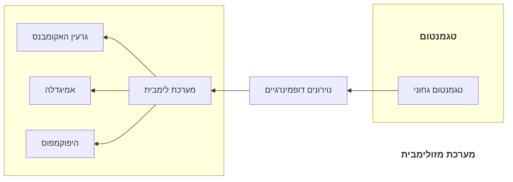

---
aliases:
- mesolimbic system
---
![[Pasted image 20240306172852.png]]
- מערכת [[נוירונים דופמינרגיים]] היוצאים מ[[טגמנטום#טגמנטום גחוני]] אל ה[[מערכת לימבית]] ופרט [[גרעין האקומבנס]], [[אמיגדלה]] ו[[היפוקמפוס]]
- [[חיזוק]]

^4679f0
# 1	[[תסמינים חיוביים של סכיזופרניה]]

- שולטת על תסמינים חיוביים של סכיזופרניה
- הפעלה של מנגוני חיזוק בנסיבות בלתי הולמות; מחזקים צורות התנהגות שאינן הולמות
- [[תסמינים חיוביים של סכיזופרניה]] נגמרים בשל פעילות יתר של [[סינפסה]] [[דופמין]] ב[[מערכת מזולימבית]]

## 1.1	השפעות אנטגוניסטים

### 1.1.1	[[כלורפרומזין]]

 - מקל על [[תסמינים חיוביים של סכיזופרניה]]
 - [[אנטגוניסט]] [[קולטן דופמינרגי D2]]

## 1.2	השפעות אגוניסטים

- מחזק או מייצר [[תסמינים חיוביים של סכיזופרניה]]

### 1.2.1	[[אמפטמין]]

### 1.2.2	[[קוקאין]]

### 1.2.3	[[מתילפדינט]]

### 1.2.4	[[L-DOPA]]

## 1.3	ליקויים בהעברת [[דופמין]]

- [[נוירון|נוירונים]] ב[[מערכת מזולימבית]] אכן פולטים יותר [[דופמין]] אך לא סביר שזהו הגורם היחיד ל[[סכיזופרניה]]

## 1.4	השלכות טיפול תרופתי ארוך בסכיזופרניה

- תופעות לוואי של [[דופמין]]
	- תסמינים של [[מחלת הפרקינסון]] או הפוכים לה
	- רגישות יתר