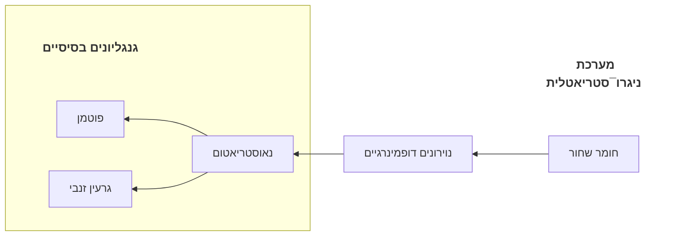

---
aliases:
- nigrostriatal system
---
![[Pasted image 20240306161236.png]]
- מערכת [[נוירונים דופמינרגיים]] היוצאים מ[[חומר שחור]] ומגיעים אל ה[[נאוסטריאטום]]
- [[תנועה]]

```mermaid
graph RL;
	G[מערכת ניגרו¯סטריאטלית]
    BS[גנגליונים בסיסיים]
    NS[חומר שחור]
    DN[נוירונים דופמינרגיים]
    NSM[נאוסטריאטום]
    P[פוטמן]
    CN[גרעין זנבי]
	G:::header
    NS-->DN
    DN-->NSM
    subgraph SG1[" "]
	    BS:::header
		NSM-->P
		NSM-->CN
		end

    class G,BS,NS,DN,NSM,P,CN internal-link;
    classDef header fill:transparent,font-size:18px,text-anchor:middle,stroke-width:0px,font-weight:bold;

```

^94af43

