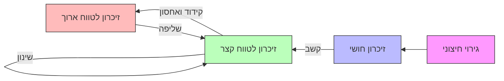

# קשב Attention
## הפניית תשומת לב

### הקשב כעיבוד מידע
#### מטלת האזנה דיכוטית
- **תיאור הניסוי**:
  - השמעת מילים שונות לכל אוזן.
  - הנבדק מבצע **הצללה (shadowing)**: חוזר בקול על המילים מהאוזן הקשובה ומתעלם מהאוזן הלא קשובה.
  - בוחנים מה הנבדקים זוכרים **מהאוזן הלא קשובה**.
- **ממצאים מרכזיים**:
  - נבדקים מצליחים להצליל את המסר באוזן הקשובה.
  - מזהים נתונים פיזיקליים באוזן הלא קשובה, אך לא תוכן סמנטי.

#### אפקט מסיבת הקוקטייל
- **הגדרה**: יכולת להתמקד בערוץ אחד ולהתעלם מאחרים, בדומה לשיחה במסיבה.
- **תובנה**: ישנם גירויים נקלטים גם ממסרים לא קשובים.

#### מודל הפילטר של ברודבנט (Broadbent, 1958)
- **תיאור המודל**:
  - **מודל צוואר בקבוק**: סלקציה מוקדמת לפני עיבוד סמנטי.
  - המסר הקשוב עובר פילטר לפי מאפיינים פיזיקליים (מין, טון, מבטא).
  - רק המסר הקשוב מעובד ומשמעותו מועברת לזיכרון ולתגובה.
- **אתגר למודל**:
  - ניסוי של מוריי (Moray, 1969): זיהוי שם פרטי באוזן הלא קשובה סתר את הניבוי של סלקציה מוקדמת.

#### מודל המחלש של טריזמן (Treisman, 1964)
- **תיאור המודל**:
  - הגירוי באוזן הלא קשובה עובר **החלשה**, אך אינו נחסם לגמרי.
  - **יחידת מילון** מזהה תבניות צלילים; מילים חשובות או שכיחות זוכות לסף הפעלה נמוך.
- **משמעות**: מידע רלוונטי עובר לזיכרון ולמודעות גם אם אינו קשוב.

#### מודל הסלקציה המאוחרת (MacKay, 1973)
- **ניסוי**: מילה דו-משמעית באוזן הקשובה עם רמז באוזן הלא קשובה.
- **מסקנה**:
  - עיבוד סמנטי קורה גם לגירויים לא קשובים.
  - סלקציה קשבית מתרחשת **לאחר עיבוד סמנטי**.

### תיאוריית קיבולת העיבוד והעומס התפיסתי (Lavie, 2005)
- **מושגים מרכזיים**:
  - **קיבולת עיבוד**: כמות מידע שניתן לעבד בו-זמנית.
  - **עומס תפיסתי**: רמת הקושי של המשימה.
- **ממצאים (Forster & Lavie, 2008)**:
  - זמן תגובה מתארך בעומס תפיסתי גבוה.
  - גירוי לא רלוונטי משפיע יותר בעומס נמוך.

### אפקט סטרופ (Stroop, 1935)
- **מטלה**: זיהוי צבע המילה הכתובה.
- **מסקנות**:
  - זמן תגובה קצר יותר בתנאים תואמים.
  - גירוי לא רלוונטי (משמעות המילה) מעובד ומשפיע, משמע שהקשב אינו חוסם אותו.

---

# זיכרון Memory
## המודל המודאלי של הזיכרון (Atkinson & Shiffrin, 1968)

- **תהליך הזיכרון**:
  - קלט → זיכרון חושי → קשב → זיכרון לטווח קצר → שינון → זיכרון לטווח ארוך.
- **רכיבי הזיכרון**:
  - **זיכרון חושי**: שימור קצר מאוד של גירוי.
  - **זיכרון לטווח קצר**: שימור לזמן מוגבל.
  - **זיכרון לטווח ארוך**: אחסון מידע לתקופה ממושכת.

### הזיכרון החושי
#### תופעת ההתמשכות
- **הגדרה**: תחושת גירוי נמשכת זמן קצר לאחר שהגירוי נעלם.
- **ניסוי ספרלינג (Sperling)**:
  - **דיווח מלא**: דיווח על מטריצת אותיות; זיכרון חושי מוגבל בכמות.
  - **דיווח חלקי**: דיווח על שורה לפי צליל; זיכרון חושי דועך מהר מאוד.
  - **דיווח חלקי מושהה**: זיכרון חושי דועך ביחס לזמן ההשהיה.

---