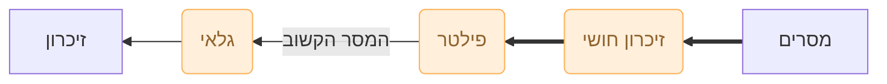
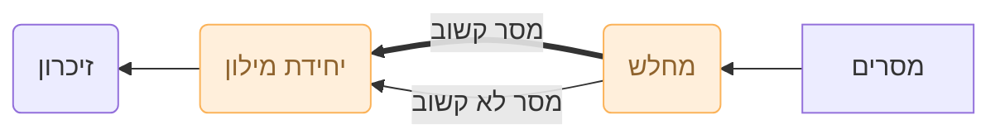
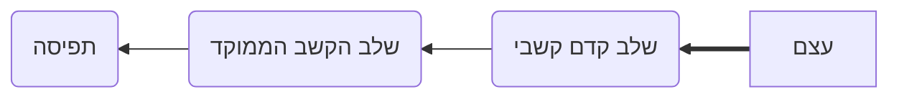

# קשב
---
- **קשב; attention**: היכולת להתמקד בגירויים או במיקומים מסויימים
- **קשב סלקטיבי; selective attention**: שימת לב לדבר אחד תוך התעלמות מדברים אחרים
- **הסחה; distraction**: כאשר גירוי אחד מפריע לעיבודו של גירוי אחר
- **קשב מפוצל; divided attention**: הפניית קשב ליותר מדבר אחד בו זמנית
- **לכידת קשב; attention capture**: הסטה מהירה של הקשב בשל גירוי חזק
- **סריקה חזותית; visual scanning**: תנועה של עיניים ממקום למקון ומעצם לעצם
---
## הקשב כעיבוד מידע
- ניסויי [[הפסיכולוגיה האינטרוספקטיבית]] ← [[ביהביוריזם]] ← דונלד ברודבנט

- בדיקת [[קשב סלקטיבי]] הניבה את [[מודל הפילטר של הקשב]]; filter model of attention
- ניסוי **האזנה דיכוטית; dichotic listening**
	- לנבדק מוצגים גירויים שונים באוזן ימים ואוזן שמאל. עליו למקד את *באוזן הקשובה* *ולהצליל* את הנשמע
- ממצאים:
	- **קולין צ׳רי; Colin Cherry**
		- נבדקים מצליחים להצליל את האוזן הקשובה
		- נבדקים מצליחים לדווח את מין (זכר או נקבה) הדובר באוזן הלא קשובה
		- נבדקים אינם מצליחים לדווח על הנאמר באוזן הלא קשובה
	- **מוויל מוררי; Neville Moray**
		- נבדקים לא מודעים למילה שהושמעה 35 פעמים באוזן הלא קשובה
- **אפקט מסיבת הקוקטייל; cocktail party effect**: היכולת להתמקד בגירוי אחד ולסנן החוצה גירויים אחרים
### המודל של ברודבנט - מודל הפילטר של הקשב
- **מודל צוואר בקבוק; bottle neck model. מודל סלקציה מוקדמת; early selection model**
	1. **זיכרון חושי**: משמר מידע נכנס לשבריר שנייה ומעביר אותו לפילטר
	2. **פילטר**: מזהה את המסר על סמך מאפיינים פיזיקליים ומעביר רק את המסר הקשוב לעבור לגלאי
	3. **גלאי**: מעבד מידע מהמסר הקשוב כדי לזהות מאפיינים מדרגה גבוהה.
	4. **זיכרון לטווח קצר**: מחזיק מידע למשך 10-15 שניות **זיכרון לטווח ארוך**: מחזיק מידע לזמן בלתי מוגדל

### שינוי המודל של ברודבנט - מודלים נוספים של סלקציה מוקדמת

- **נוויל מוררי, Moray 1959**
	- ניסוי האזנה דיכוטי
	- כשליש מהנבדקים מבחינים כאשר השם שלהם נאמר באוזן הלא קשובה
	- נוגד את התיאורית הקשב המוקדם כי מסר עבר את הפילטר
- **ניסוי ג׳יין דודה יקרהת J.A. Gray, A. I. Wedderburn, 1960**
	- ניסוי האזנה דיכוטי
	- האוזן הקשובה מקבלת ״ג׳יין 7 יקרה״
	- האוזן הלא קשבוה מקבלת ״9 דודה 6״
	- הנבדקים הצלילו ״ג׳יין דודה יקרה״
- **מודל המחלש של הקשב; attenuation model of attention, מודל הפילטר הדולף של אין טריזמן, 1964**
	- **מחלש; attenuation**: מנתח מסר במנוחים של:
		- מאפיינים פיזיקלים
		- שפה
		- משמעות
	- **יחידת המילון, dictionary unit**
		- השלב השני
		- קובע את הפלט הסופי של המערכת
		- מנתחת את המסר
		- מכילה מילים בזיכרון, לכל מילה סף הפעלה
		- סף נמוך ← מספיק אות חלש
		- סף גבוה ← צריך אות חזק

### מודל של סלקציה מאוחרת
- late selection model of attention
- תיאוריות בהם הסלקציה של מסרים אחרי העיבוד, על פי משמעות. 
- **דונלד מקיי; MacKay, 1973**
	- נסוי האזנה דיכוטי
	- נדבק מאזין למשפט רב משמעי באוזן הקשובה
	- באוזן הלא קשובה ישנם מילים שעשויות להטות את כוונת המשפט
	- המילים הלא קשובות השפיעו על כיוון הפירוש של המשפט הדו משמעי

## קיבולת עיבוד ועומס תפיסתי
- הוכח ששלב העיבוד משתנה בין משימות, לכן עברה השאלה להיחקר במונחים של קיבלת עיבוד ועומס תפיסתי
---
- **קיבלת עיבוד; processing capacity**: כמות המידע שאנשים מסכולגים לטפל בה
- **עומס תפיסתי; perceptual load**: רמת הקושי של המטלה
	- **מטלות עומס נמוך; low-load tasks**: מטלה המנצלת רק חלק קטן מקיבולת העיבוד
	- **מטלות עומס גבוהה; high-load tasks**: מטלות המנצלות חלק גדול מקיבולת העיבוד
---
- **סופי פורסטר ולביא, Forster & Lavie, 2008**
	- מטלת הנבדקים: להגיב מהר ככל האפשר כאשר זיהו מטרה: האות X או האות N
		- מקש אחד עבור X מקש אחר עבור N
	- שני סוגי גירויים: קל (אותיות מאוד שונות) וקשה (אותיות מאוד דומות)
	- ממצאים: כאשר התווסף **גירוי לא רלוונטי** (תמונה של כלב) זמן התגובה במטלה הקלה עלה **יותר** מזמן התגובה במטלה הקשה
- **תיאוריית העומס של הקשב; load theory of attention**
	- מטלה עם עומס נמוך ← נשאר קיבולת עיבוד ← משאבים זמינים לגירוי לא רלוונטי
	- מטלה עם עומס גבוה ← לא נותר קיבלת עיבוד ← אין משאבים זמינים לגירוי לא רלוונטי

### אפקט סטרופ; stroop effect, 1935
- האטה של תגובה למטרה בשל תגובה מתחרה בשל גירויים לא רלוונטים חזקים

## הקשב כסלקציה - קשב גלוי וקשב סמוי

- **קשב גלוי; overt attention**: הסטת קשב על ידי תנועת עיניים
- **קשב סמוי**: הסטת קשב ממקום ללא תנועת עיניים

### קשב גלוי - סריקה של סצנה בתנועות עיניים

---
- **ראייה מרכזית; central vision**: האזור עליו מסתכלים
- **ראייה היקפית; peripheral vision**: כל מה שבצדי הראייה
- **גומה, פוביאה**: אזור ב[[רשתית העין]] הקולט עצמים שבטווח הראייה המרכזית
	- מאשר ראייה טובה ומפורטת יותר מאשר הרשתית ההיקפית, עליה נופלת שאר התמונה
- **פיקסציה; fixation**: התמקדות, ״להניח״ את המבט על אובייקט
- **תנועות עיניים סקאדיות; saccadic eye movement**: תנועת עיניים מהירה וקפוצנית בין נקודת פיקסציה אחת לאחרת

#### סריקה המבוססת על בולטות הגירוי
- **בולטות הגירוי; stimulus salience**: תכונות פיזיקליות של הגירוי
	- תהליך מלמטה למעלה - מהגירוי לעיבוד
- **מפת בולטות; saliency map**: עוזר לנתח איך גירוי בולט משפיע על אופן סריקת סצנה

#### סריקה המבוססת על גורמים קוגניטיביים
- עיבוד על פי משמעות; משתנה משמעותית בין אדם לאדם
	- עיבוד מלמעלה למטה - מהמשמעות לסריקה
	- קשור לידע מוקדם של הצופה.

#### סריקה המבוססת על דרישות המטלה
- סדר מטלות מוכר משפיע על תהליך הסריקה וסדר הקשב והפיקסציות, למשל בהכנת כריך
	- לרוב תנועת העיניים מקדימה על הפעולה המוטורית בשבריר שנייה

### קשב סמוי - הפניית קשב בלי תנועות עיניים

- **קשב סמוי; covert attention**: הסטת קשב ללא הזזה של העיניים
#### קשב למיקום
- **רמז מטרים; precueing**: הצגה של מידע באיזור מסויים בכדי להשפיע על מיקוד הקשב
	- **תנאי תקף**: ריבוע המטרה מופיע במצד שרמז החץ הצביע עליו
	- **תנאי לא תקף**: ריבוע המטרה מופיע בצד השונה מזה שרמז החץ הצביע עליו
- **מייקל פוזנר; Michael Posner**
	- האם מיקוד הקשב במיקום משפר את יכולתו של האדם להגיב לגירויים המוצגים בו?
	- הנבדקים הגיבו לריבוע המטרה מהר יותר כאשר הקשב שלהם הופנה קודם לכן למיקום שבו הוא הופיע
	- עיבוד מידע יעיל יותר באזור שהקשב מופנה אליו
	- זרקור אור כאנלוגיה לקשב
#### קשב לעצמים
- **אגלי; Egly et al., 1994**
	- רמז מטרים עבור חלקו העליון של אובייקט שיפר את התנאי התקף בניסיון לזהות את ריבוע המטרה בתוך אותו אובייקט, לעומת אובייקט אחר. 
	- ![[Pasted image 20241218153216.png]]
	- **יתרון אותו העצם; same-object advantage**
## קשב מפוצל - האם אנו מסוגלים להיות קשובים ליותר מדבר אחד בו זמנית?
- חלוקת קשב הינה אפשרית ותלויה בגורמים שונים למשל: תרגול ורמת הקושי של המטלה

### עיבוד אוטומטי
- **חלוקת קשב באמצעות תרגולת ווטלר שניידר וריצ׳רד שיפרין; Walter Schneider, Richard Shiffrin**
	- נבדק נדרש לבצע שתי מטלות בו זמנית
		1. להחזיק מידע על גירוי מטרה בזיכרון
		2. להפנות קשב לסדרה של גירויים מסיחים ולקובע אם אחד מהגירויי המטרה נמצא בקרב גירויים המסיחים
	- **גירויי המטרה**: *מערך זיכרון* המכיל עד ארבע ספרות
	- **מסיחים**: הבזקים מהירים של אותיות, אחת מעשרים הכילה גירוי ממערך הזיכרון
	- תחילת הניסוי: 55% דיוק
	- לאחר 900 צעדי ניסוי: 90% דיוק
	- ![[Pasted image 20241218153848.png]]
	- **עיבוד אוטומטי; automatic processing**: עיבוד המתבצע ללא כוונה או תוך שימוש בחלק קטן מהמשאבים הקוגניטיים

### פיצול הקשב נעשה קשה יותר כאשר המטלות קשות יותר
- ישנם מקרים בהם עיבוד אוטומטי אינו אפשרי גם לאחר אימון

### הסחות בעת נהיגה
- **מחקר הנהיגה הטבעית של 100 מכוניות; Dingus et al., 2006**
	- תועדו 82 התנגשויות ו 771 של כמעט התנגשויות
	- ב 80% ממקרי ההתנגשויות ו 67% ממקרי הכמעט התנגשויות הנהג לא היה קשוב שלוש שניות לפני המקרה
	- ב 22% ממקרי ההתנגשות הגורם המסיח היה הקלדה בטלפון הנייד

## מה קורה כאשר איננו קשובים?
### עיוורון קשבי

- **עיוורון קשבי; inattentional blindness**: 
- **עיוורון קשבי בתוך סצנה, דניאל סיימונס וכריסטופר צ׳רביס; Daniel Simons, Christopher Chabris**
	- סרטון של 75 שניות בו שני קבוצות מתמסרות בכדור, קבוצה לבנה וקבוצה שחורה.
	- על הנבדק לספור את מספר המסירות של קבוצה מסויימת
	- במהלך הסרטון מופיע אדם לבוש כגורילה במקום גלוי, למשך 5 שניות
	- 46% מהצופים לא הבחינו בגורילה

### גילוי שינויים
- **עיוורון לשינוי; change blindness**: קושי בגילוי שינויים בין סצנות
	- כמו שסדרות (בעיקר סיטקומים) בהם יש שינויים בין פריימים עוקבים, אך לרוב איננו מבחינים בהם. גם אם אומרים לנו על כך מראש
	- google "continuity errors in movies"

- מערכת התפיסה בנויה היטב לקליטת מידע הנדרש להישרדות

## קשב וחוויה של עולם קוהרנטי
- **חיבור; binding**: תהליך בו תכונות שונות של של יוצרות תפיסה של עצם לכיד

### למה צריך חיבור?
- החלקים השונים של תפיסת תכונות מצויים באזורים שונים במוח אך נתפסים כדבר אחד קוהנרטי
- **בעיית האיגוד; binding problem**: השאלה איך תכונות נפרדות נקשרות יחד

### התיאוריה של אינטגרציית התכונות
- **התיאוריה של אינטגרציית התכונות; feature integration theory**: 
- תיאוריה של אן טריזמן; Treismann, 1986, 1988, 1999
- איך אנו תופסים תכונות נפרדות כחלק מאותו העצם?
- תהליך דו שלבי:

#### השלב הקדם קשבי
- **השלב הקדם קשבי; preattentive stage**:
	- עצמים מנותחים לפי תכונות נפרדות באופן בלתי תלוי 
		- צבע, צורה, תנועה
- **חיבורים אשלייתיים; illusory conjunctions**: שילובים של תכונות מגירויים שונים בצורה לא נכונה
	- מתרחשים משום שבשלב הקדם קשבי כל תכונה מתקיימת באופן לא תלוי, ללא שיוך לעצם
#### שלב הקשב הממוקד
- **שלב הקשב הממוקד; focused attention stage**
	- השלב בו התכוניות מתחברות לכדי עצם אחד
- **חיפוש חזותי; visual search**: כל חיפוש עצם בין מספר עצמים
- **חיפוש תכוניתי; feature search**: חיפוש של תכונית מסויימת (משהו אדום)
- **חיפוש חיבורי; conjunction search**: חיפוש של חיבור בין תכוניות (משהו אדום ואנכי)

## התמקדות של המוח
- המוח מייצר מפה טופוגרפית בקורטקס הויזואלי וקיים קשר בין מיקום הפעילות שם לבין מיקום המיקוד הסמוי
- כאשר יש צורך להתמקד בגירוי אחד מבין שני גירויים מסוגים שונים, עולה הפעילות באזור המיועד לעיבוד, למשל, כשיש צורך להבחין בין פנים ובניינים, עולה פעילות ה[[fusiform face area]] לעומת ה[[parahippocampal place area]], למשל במקרים של אשליות אופטיות שבניינים יוצרים פנים
![[Pasted image 20241218162503.png]]