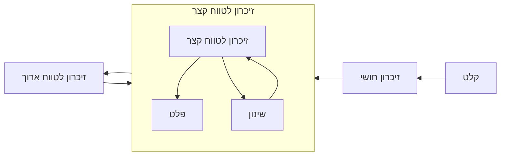

- **זיכרון**: תהליך המעורב באחסון, שליפה ושימוש במידע על אודות גירויים, דימויים, אירועיים, רעיונות ומיומנויות לאחר שהמידע המקורי אינו עוד בנמצא
- **זיכרון חושי**: התמשכות קצרה של דימוי לאחר תפיסה
- **זיכרון לטווח קצר; זיכרון עבודה**: מידע הנשמר לפרקי זמן קצרים של כ 10 עד 15 שניות
- **זיכרון לטווח ארוך**: אחסון של מידע לפרקי זמן ממושכים
- **זיכרונות אפיזודיים**: זיכרונות לטווח ארוך של חוויות מהעבר
- **זיכרון פרוצדורלי**: זיכרון לטווח ארוך הקשור בתיאום עם מוטורי
- **זיכרון סמנטי**: זיכרונות של עובדות

# 1	המודל המודאלי של הזיכרון

- ריצ׳רד אטקינסון (Richard Atkinson) וריצ׳רד שיפרין (Richard Shiffrin)
1. **הזיכרון החושי**: שלב התחלתי אשר משמר את כל המידע הנכנס למשך זמן קצר מאוד
2. **הזיכרון לטווח קצר**: משמר 5-7 פרטים למשך 15-20 שניות
3. **הזיכרון לטווח ארוך**: כמות גדולה של מידע עד עשרות שנים



- **הרכיבים המבניים של המודל; structural features**: כל סוגי הזיכרון לעיל
- **תהליכי בקרה; control processes**: תהליכים דינמיים הקשורים לרכיבים המבניים אשר אדם יכול לשלוט בהם והם משתנים ממטלה למטלה
	- **שינון; rehearsal**: תהליך בקרה הפועל על זיכרון לטווח קצר

# 2	הזיכרון החושי

- **הזיכרון החושי; sensory memory**: שימור קצר השפעות הגרייה החושית

## 2.1	שובל הזיקוק וצמצם המקרן

- שובל אור של זיקוק מתנפנף אינו אמיתי אלא תוצאה של **התמשכות חזותית**

## 2.2	הניסוי של ספרלינג

- מונחים מקדימים:
	- **שיטת הדיווח המלא; whole report method**: דיווח על מידע גדול ככל האפשר מהקלט
	- **שיטת הדיווח החלקי**: דיווח על שורת מידע אחת בלבד, בהתאם לצליל מוסכם מראש
	- **שיטת הדיווח החלקי המושהה**: דיווח על שורת מידע אחת בלבד, בהתאם לצליל מוסכם מראש, לאחר השהייה בין הגירוי לדיווח. 
	- **זיכרון איקוני; iconic memory**: זיכרון חושי קצר לגירויים חזותיים
	- **זיכרון אקואי; echoic memory**: זיכרון חושי קצר לגירויים שמיעתיים

- ג׳ורג ספרלינג (George Sperling): כמה מידע אנשים מסוגלים לקלוט מגירויים קצרים?
- מוצג לנבדק קלט של 12 אותיות ועליו לדווח לפי שיטת הדיווח המלא.
	- הנבדקים הצליחו לדווח בממוצע על 4.5 אותיות מתוך 12
- מוצג לנבדק קלט של 12 אותיות ועליו לדווח לפי שיטת הדיווח החלקי
	- הנבדקים הצליחו לדווח בממוצע על 3.3 אותיות מתוך 4
- מוצג לנבדק קלט של 12 אותיות ועליו לדווח לפי שיטת הדיווח החלקי המושהה בהשהייה של 1ש
	- הנבדקים הצליחו לדווח בממוצע על 1.5 אותיות בשורה בממוצע
- מסקנות:
	- זיכרון חושי קצר מועד קולט את כל או מרבית המידע המגיע לקולטנים החזותיים
	- המידע דועך בפחות משנייה
	- זיכרון איקוני מקביל לשלב הזיכרון החושי במודל המודאלי
	- הזיכרון החושי מסוגל להחזיק כמויות מידע עצומות אך אינו מסוגל לשמר אותו

# 3	הזיכרון לטווח קצר

- **זיכרון לטווח קצר; short term memory; STM**: מערכת המאחסנת כמויות מידע קטנות לזמן קצר
- **שאלות**:
	1. מהו משך הזיכרון לטווח קצר?
	2. מהי קיבות הזיכרון לטווח קצר?
- **מונחים מקדימים**:
	- **שיטת ההיזכרות; recall**: נבדקים חווים גירויים ומתבקשים לדווח מזכרונם על כמה שיותר מהם. ביצועי הזיכרון נמדדים באחוז הגירויים שנזכרו

## 3.1	מהו משך הזיכרון לטווח קצר?

- **דעיכה; decay**: זיכרון נמוג במרוצת הזמן
- **הפרעה למאוחר; proactive interference**: הפרעה שמתרחשת כאשר מידע שנלמד קודם מפריע ללמידת מידע חדש
- **הפרעה למוקדם; retroactive interference**: למידה חדשה מפריע לנו מה שלמדנו לפני כן

## 3.2	כמה פריטים אפשר להחזיר בזיכרון לטווח קצר?

- הערכות: בין 4 ל 9 פריטים

- **קיבולת היזכרות בספרות; digit span**: מספר הספרות שאדם מסוגל להחזיק בזיכרון
- **גילוי שינויים; change detection**: כמה מידע מתוך גירוי שמוצג לזמן קצר אדם מסוגל להחזיק

- **יצירת גושים; chunking**: שילוב חלקי מידע קטנים בכדי ליצור יחידות גדולות יותר בעלות משמעות
- **גוש; chunk**: אוסף של רכיבים בעלי קשר חזק

## 3.3	כמה מידע אפשר להחזיק בזיכרון לטווח קצר?

- מורכבות הגירויים מקשה על שמירת הזיכרון לטווח קצר

# 4	זיכרון העבודה

- **זיכרון עבודה**: מערכת בעלת קיבולת מוגבלת לאחסון זמני ולמניפולציה של מידע לצורך מטלות מורכבות כמה הבנה, למידה והסקה
- **לולאה פונולוגית; phonological loop**: מידע מילולי ושמיעתי
	- **המאגר הפונולוגי; phonological store**: משמר מידע לשניות מועטות בלבד
	- **תהליך שינון הגייתי; articulatory rehearsal process**: שינון, מונע דעיכה של פריטים במאגר הפונולוגי
- **לוח חזותי מרחבי visuospatial sketch pad**: מידע חזותי ומרחבי
- **מנהל מרכזי central executive**:
	- מתאם בין הלולאה הפונולוגית והלוח חזותי מרחבי
	- שולף מידע מהזיכרון לטווח ארוך
	- מחליט איך לחלק את הקשב בהתאם למטלה

## 4.1	הלולאה הפונולוגית

- טיעונים תומכים בתיאוריה

- **אפקט הדימיון הפונולוגי; phonological similarity effect**: בלבול בין אותיות או מילים הנשמעות דומה
	- מילים מעובדות פונולוגית, לכן שינון וטעויות הבנה לעיתים בסיסם אינו בראייה אלא בשמיעה!

- **אפקט אורך המילה; word length effect**: אנו זוכרים יותר מילים קצרות מאשר מילים ארוכות, גם כאשר מס האותיות זהה. 
	- מספר הפריטים אשר אנשים מסוגלים להחזיק בזיכרון העבודה זהה למספר הפריטים שהם מסוגלים להגות בשנייה וחצי עד שתי שניות

- **דיכוי הגייתי; articulatory suppression**: חזרה על צליל בלתי רלוונטי
	- מפריעה לשינון וכן לזיכרון
	- מבטל את אפקט אורך המילה

## 4.2	הלוח החזותי מרחבי

- **דימיון חזותי; visual imagery**: יצירת דימיון בראש
- **רוטציה מנטלית; mental rotation**: רוטציה של תמונה בראש

# 5	המנהל המרכזי

- מתאם שימוש מידע בין הלוח החזותי מרחבי והלולאה הפונולוגית 
- שולט בקשב
- **פרסברציה; perseveration**: חזרה על אותה פעולה או מחשבה גם אם אינה מניבה את המטרה הרצויה

- **פוטנציאל תלוי גירוי; ERP**: תגובה מוחית המציינת באיזו מידה קבוצות של נוירונים היורות יחד פועלות
	- ERP גדול יותר מציין כי נתפס יותר מקום בזיכרון העבודה

## 5.1	המאגר האפיזודי

- **המאגר האפיזודי; episodic buffer**: מאחסן מידע ומקיים קשר עם הזיכרון לטווח ארוך

```mermaid
graph BT
	A["מנהל מרכזי"]
	B1["לוח חזותי מרחבי"]
	B2["מאגר אפיזודי"]
	B3["לולאה פונולוגית"]
	C1["זיכרון לטווח ארוך"]

	C1 <--> B1 <--> A
	C1 <--> B2 <--> A
	C1 <-→ B3 <--> A
```

# 6	זיכרון העבודה והמוח

- **שיטות מחקר בפסיכולוגיה קוגניטיבית בקשר בין תפקוד קוגניטיבי למוח**
	1. ניתוח התנהגות של בני אדם או של בעלי חיים לאחר פגיעה מוחית
	2. רישום מנוירונים יחידים אצל חיות
	3. מדידת הפעילות במוח האדם
	4. רישום של אותות חשמליים במוח האדם
![[Pasted image 20241223201242.png]]


## 6.1	השפעה של פגע ב[[קורטקס קדם מצחי]]
- **מטלת התגובה המושהית; delayed response task**: התבוננות, השהייה (הסתרה), בחירה לפי זיכרון. 
	- קופים ללא קורטקס קדם מצחי אינם מסוגלים לבחור, הבחירה יורדת לרמת המקרה (chance)
- הקורטקס הקדם מצחי חשוב להחזקת מידע לפרקי זמן קצרים

## 6.2	נוירונים ב[[קורטקס קדם מצחי]] מחזיקים מידע

- פונאשי 2006
- קיימים נוירונים אשר ממשיכים להגיב עבור תמונה בפרק זמן ההשהייה

## 6.3	החזקה של מידע ה[[קורטקס ראייה ראשוני]]

- **קריאת מחשבות עצבית; neural mind reading**: שימוש במדידת ווקסלים ב fMRI בכדי לחזות מה אדם תופס או חושב
- נשמר מידע בסגנון זיכרון עבודה בקורטקס החזותי

# 7	חומר למחשבה

## 7.1	ביצועים במתמטיקה וזיכרון עבודה
