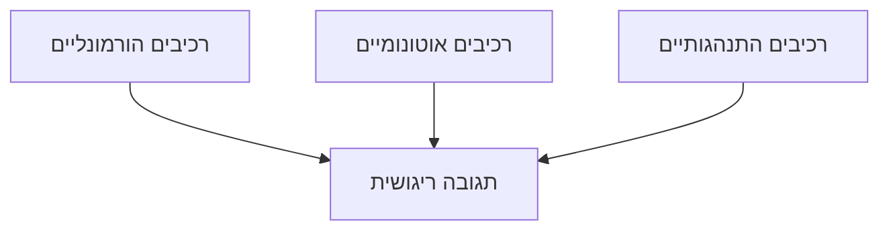

```mermaid
graph TD
    A[רכיבים הורמונליים]
    B[רכיבים אוטונומיים]
    C[רכיבים התנהגותיים]
    D[תגובה ריגושית]
    
    A --> D
    B --> D
    C --> D
    
    class A,B,C,D internal-link;
```