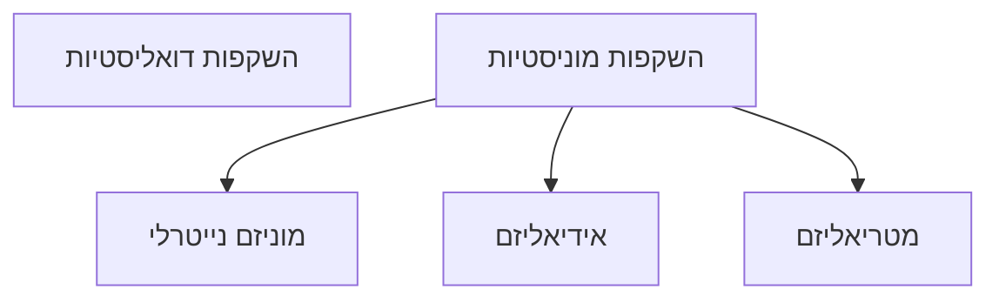

![[Pasted image 20240529052337.png|Vitruvian Man, Leonardo Da Vinci]]
- האם מצבים נפשיים חלק המעולם הפיזיקלי?
- זוהי שאלת הגוף והנפש או השאלה הפסיכופיזית
## [[טענות]]
1. ל[[מצבים נפשיים]] יש [[מכוונות של מצבים נפשיים|מכוונות]]. 
2. ל[[מצבים פיזיקליים]] אין מכוונות. 
3. לפיכך, מצבים נפשיים אינם פיזיקלים. 
- בטיעון טעות לוגית **הנחת המבוקש**.

